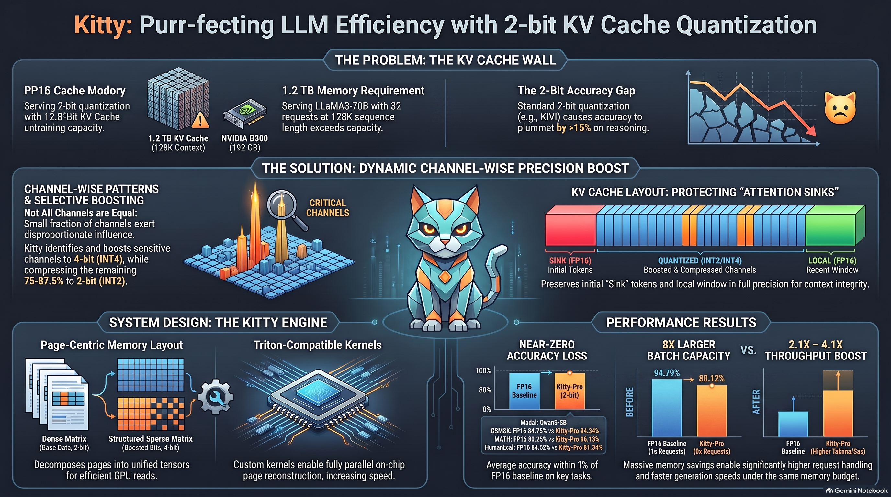
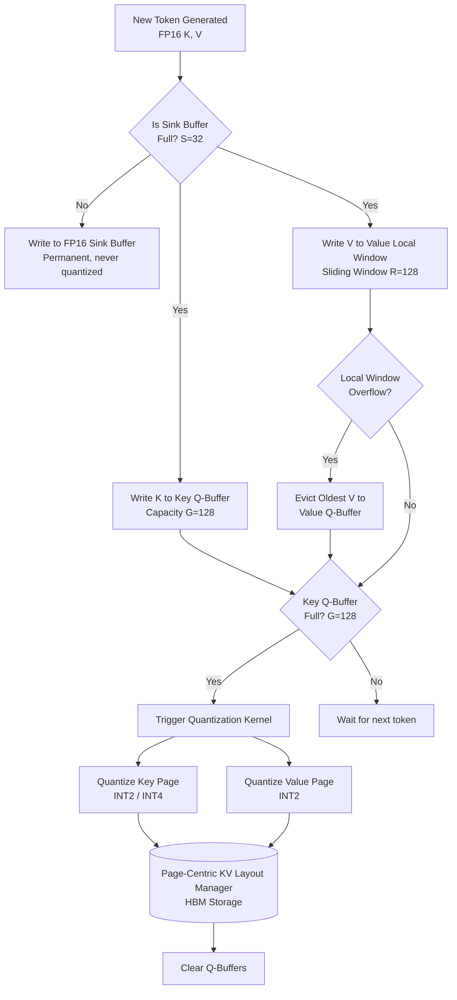
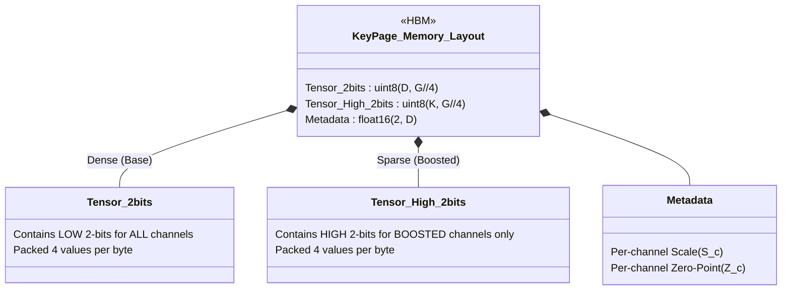

# Kitty: Purr-fecting LLM Efficiency with 2-bit KV Cache Quantization

[](https://arxiv.org/abs/2511.18643)

Kitty is a PyTorch and OpenAI Triton-based framework that achieves near-lossless **2-bit KV cache quantization** for Large Language Models (LLMs). By selectively boosting critical channels to 4-bit (INT4) while aggressively compressing the rest to 2-bit (INT2), Kitty overcomes the memory constraints of extreme context lengths, delivering up to **~8× memory reduction** and a massive boost in batch capacity and throughput.



---

## 📖 The Problem: The KV Cache Wall

As sequence lengths in LLMs grow to 128K tokens and beyond, the Key-Value (KV) cache becomes the primary memory bottleneck. Serving a 70B parameter model with a 128K context for just 32 concurrent requests requires over **1.2 TB of VRAM** for the KV cache alone, far exceeding the capacity of standard GPU nodes.

Standard uniform 2-bit quantization (like KIVI) causes unacceptable accuracy degradation (>15% drop on reasoning tasks) due to outlier values in critical attention channels.

## 💡 The Solution: Dynamic Channel-Wise Precision Boost

Kitty solves this through a hybrid precision approach based on **Channel-Wise Sensitivity**:
- **Identify**: A small fraction of channels (12.5% - 25%) carry disproportionate influence over attention scores.
- **Boost**: These critical channels are preserved in 4-bit (INT4) precision.
- **Compress**: The remaining majority of channels are aggressively quantized to 2-bit (INT2).

This hybrid approach bridges the accuracy gap, keeping performance within 1% of the FP16 baseline while achieving massive memory savings.

---

## 🏗️ System Architecture

### 1. The Runtime Pipeline

Kitty operates a sophisticated 4-stage token pipeline to manage memory efficiently during streaming inference.



### 2. Dense-Sparse Decomposition Layout

To ensure highly efficient, coalesced memory reads on GPUs, Kitty decomposes the mixed-precision Key cache into structured dense and sparse tensors, completely avoiding scattered HBM accesses.



---

## 🧮 Mathematical Formulation

### Key Cache Quantization (Per-Channel)

For a key block $X \in \mathbb{R}^{D \times G}$:
1. **Range**: $\text{Scale}_c = \frac{\max(X_c) - \min(X_c)}{2^b - 1}$ (where $b=4$ for boosted, $b=2$ for standard)
2. **Zero-Point**: $Z_c = \text{round}\left(-\frac{\min(X_c)}{\text{Scale}_c}\right)$
3. **Quantize**: $\hat{X}_c = \text{clip}\left(\text{round}\left(\frac{X_c}{\text{Scale}_c}\right) + Z_c, 0, 2^b - 1\right)$
4. **Decompose**: 
   - $X_{\text{low}} = \hat{X}_c \ \& \ 0x03$ (Stored in Dense Tensor)
   - $X_{\text{high}} = (\hat{X}_c \gg 2) \ \& \ 0x03$ (Stored in Sparse Tensor, if boosted)

### Value Cache Quantization (Per-Token)

Value tokens are quantized per-token across the head dimension $D$, as outlier distribution differs from Keys.
- Fixed 2-bit quantization for all value tokens outside the FP16 local window.
- Packed consecutively to maximize memory bandwidth.

---

## 🚀 Performance Results

Hardware benchmark results on NVIDIA RTX 5050 (`cuda:0`, 32L, 8H, D=128, 32K Context):

| Metric | Measurement | Notes |
|--------|-------------|-------|
| **FP16 KV Cache (Baseline)** | 4096.0 MB | Full 32K context memory requirement |
| **Kitty Total Memory** | **55.1 MB** | 19.1 MB (Quant Pool) + 36.0 MB (FP16 Buffers) |
| **Compression Ratio** | **74.37×** | Massive VRAM savings 🤯 |
| **Decode Throughput** | **18.4 tokens/sec** | Single layer, 500 steps (54.2 ms/token) |
| **Key Quantisation Latency** | ~10.57 ms/page | PyTorch fallback path |
| **Key Dequantisation Latency** | ~5.77 ms/page | PyTorch fallback path |

> *Note: Compression ratio scales with sequence length. The 74x ratio reflects the deep efficiency of the layout manager allocating memory only as needed, compared to static FP16 pre-allocation.*

---

## 📦 Quick Start

### Installation

Requires Python 3.10+ and PyTorch 2.1+.

```bash
pip install torch>=2.1.0 numpy>=1.24.0
# Triton is required for optimal GPU performance (Linux/WSL only)
pip install triton>=2.1.0 
```

### 1. Offline Sensitivity Profiling

Before deploying, profile your model to identify the critical channels that require 4-bit boosting.

```python
import torch
from kitty import KittyConfig, KittySensitivityProfiler

# Initialize configuration
config = KittyConfig(
    num_layers=32,
    num_kv_heads=8,
    head_dim=128,
    boost_rate=0.125, # 12.5% channels boosted (Kitty Standard)
    max_seq_len=32768,
    device="cuda:0"
)

# Assume `my_llama_model` is your loaded HuggingFace model
profiler = KittySensitivityProfiler(config, model=my_llama_model)
profiler.register_hooks(layer_indices=list(range(32)))

# Run calibration data through the model
with torch.no_grad():
    for batch in calibration_loader:
        my_llama_model(**batch)

# Save the generated profiles
profiler.remove_hooks()
profiler.save("kitty_profiles/")
```

### 2. Model Integration

Replace the standard attention layers in your LLM with `KittyPagedAttention`.

```python
from kitty import KittyAttentionFactory

# Load the saved profile
profiler = KittySensitivityProfiler.load("kitty_profiles/", config)

# Build the complete Kitty attention stack
layout, pipeline, attn_layers = KittyAttentionFactory.from_config(
    config=config,
    boost_idx_uint8=profiler.boost_idx_uint8.to("cuda:0"),
    num_q_heads=32, # 32 query heads, 8 KV heads (GQA)
)

# Inject into the model
for i, layer in enumerate(my_llama_model.model.layers):
    layer.self_attn = attn_layers[i]

# Inference proceeds normally; Kitty manages the KV cache implicitly!
with torch.no_grad():
    output = my_llama_model.generate(input_ids, max_new_tokens=512)
```

---

## ⚙️ Configuration Variants

You can easily toggle between standard Kitty and Kitty-Pro based on your accuracy/memory budget requirements.

| Variant | Boost Rate | INT4 Channels (D=128) | Use Case |
|---------|------------|-----------------------|----------|
| **Kitty** | `0.125` (12.5%) | 16 channels | Max memory savings, near-lossless. |
| **Kitty-Pro**| `0.250` (25.0%) | 32 channels | Higher accuracy for complex reasoning tasks. |

```python
# Initialize Kitty-Pro directly
config_pro = KittyConfig.kitty_pro(
    num_layers=32, num_kv_heads=8, head_dim=128, max_seq_len=32768
)
```

---

## 🧪 Running Tests & Benchmarks

```bash
# Run the test suite
python -m pytest tests/ -v

# Run the hardware benchmark
python benchmark/benchmark_kitty_hardware.py --seq_len 32768 --num_runs 200
```
