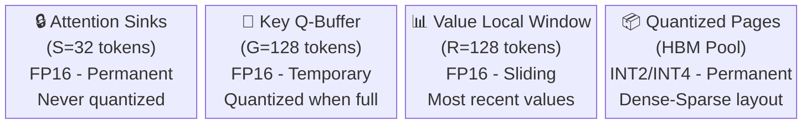
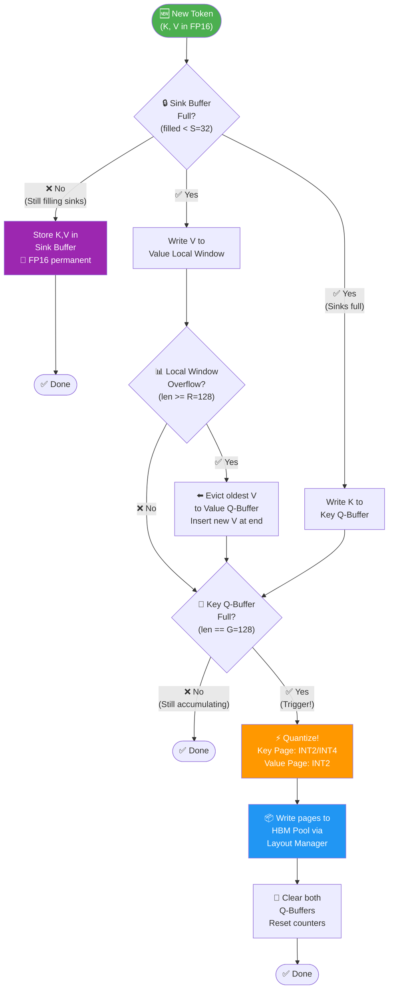
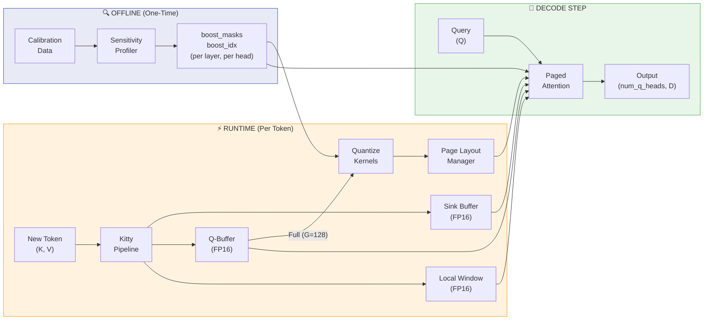

<p align="center">
  
</p>

<h1 align="center">🐱 Kitty</h1>
<h3 align="center">Purr-fecting LLM Efficiency with 2-bit KV Cache Quantization</h3>

<p align="center">
  <a href="https://arxiv.org/abs/2511.18643"></a>
  
  
  
  
</p>

<p align="center">
  <b>Near-lossless 2-bit KV cache compression for LLM inference.</b><br/>
  Selectively boosts critical channels to INT4 while compressing the rest to INT2, achieving <b>74x memory reduction</b> with accuracy within 1% of FP16.
</p>

---

## Table of Contents

- [Why Kitty?](#-why-kitty)
- [Key Features](#-key-features)
- [How It Works](#-how-it-works)
  - [The Core Insight](#the-core-insight-not-all-channels-are-equal)
  - [Four Memory Regions](#four-memory-regions)
  - [Runtime Pipeline](#runtime-pipeline-flowchart)
  - [Dense-Sparse Decomposition](#dense-sparse-memory-decomposition)
  - [Quantization Math](#quantization-mathematics)
- [Architecture Overview](#-architecture-overview)
- [Benchmark Results](#-benchmark-results)
- [Installation](#-installation)
- [Quick Start](#-quick-start)
- [Configuration](#-configuration)
- [Project Structure](#-project-structure)
- [Running Tests](#-running-tests)
- [References](#-references)

---

## 🚨 Why Kitty?

Modern LLMs are hitting a critical memory wall. As context lengths scale to **128K+ tokens**, the KV cache dominates GPU VRAM:

| Scenario | KV Cache Size | Problem |
|----------|---------------|---------|
| LLaMA-3-70B, 128K context, 32 requests | **1.2 TB** | Exceeds NVIDIA B300 (192 GB) by 6x |
| Qwen-3-8B, 32K context, 1 request | **4 GB** | Eats half a typical GPU's memory |

Previous approaches like KIVI apply **uniform 2-bit quantization** to all channels, but this causes a catastrophic **>15% accuracy drop** on reasoning tasks because critical outlier channels lose their signal.

> **Kitty solves this** by identifying and selectively boosting the small fraction of channels that matter most, preserving their information in 4-bit precision while still achieving extreme compression on the rest.

---

## ✨ Key Features

| Feature | Description |
|---------|-------------|
| 🎯 **Channel-Wise Sensitivity Profiling** | Offline calibration identifies the 12.5%-25% of channels that carry disproportionate attention influence |
| 🧠 **Hybrid INT2/INT4 Quantization** | Critical channels get 4-bit precision; the rest compress to 2-bit, achieving near-lossless quality |
| 📄 **Dense-Sparse Decomposition** | Structured memory layout ensures coalesced GPU reads with zero scattered HBM accesses |
| 🏊 **Attention Sink Protection** | First 32 tokens are preserved in full FP16 precision (they receive consistently high attention) |
| 📐 **Page-Centric Layout Manager** | Pre-allocated HBM pool with free-list allocation - zero runtime memory allocation overhead |
| ⚡ **Triton + PyTorch Kernels** | GPU-optimized Triton JIT kernels with pure PyTorch CPU fallbacks for portability |
| 🔌 **Drop-in Attention Module** | `KittyPagedAttention` is a plug-and-play `nn.Module` replacement for any transformer |
| 🧩 **GQA Support** | Full Grouped Query Attention compatibility (num_q_heads >= num_kv_heads) |

---

## 🔬 How It Works

### The Core Insight: Not All Channels Are Equal

Through empirical analysis, the Kitty paper discovered that attention head channels exhibit **highly non-uniform sensitivity**. A small minority of channels (typically 12.5%) act as critical information carriers that disproportionately influence attention scores. Quantizing these channels to just 2 bits destroys their signal. Kitty identifies these channels offline and preserves them in 4-bit precision.

```
Channel Sensitivity (s_i = mean absolute activation across tokens):

  Channel 5:  ████████████████████████████████████  s=3.2  ← CRITICAL (INT4)
  Channel 12: ██████████████████████████████████     s=2.9  ← CRITICAL (INT4)
  Channel 0:  ████████████████████                   s=1.7  ← normal   (INT2)
  Channel 3:  ██████████████████                     s=1.5  ← normal   (INT2)
  Channel 9:  █████████████                          s=1.1  ← normal   (INT2)
  Channel 7:  ████████                               s=0.7  ← normal   (INT2)
  ...

  Top 12.5% channels → Boosted to INT4 (4-bit)
  Remaining 87.5%    → Compressed to INT2 (2-bit)
```

### Four Memory Regions

Kitty partitions the KV cache into four distinct memory regions, each with a specific purpose and precision level:



| Region | Capacity | Precision | Purpose |
|--------|----------|-----------|---------|
| **Attention Sinks** | S = 32 tokens | FP16 | First tokens that receive high attention weight across all positions. Never quantized. |
| **Key Q-Buffer** | G = 128 tokens | FP16 | Accumulation buffer. When full, all G tokens are batch-quantized into a page. |
| **Value Local Window** | R = 128 tokens | FP16 | Sliding window of the most recent R value tokens. Oldest evicted to Value Q-Buffer. |
| **Quantized Pages** | Unlimited (pooled) | INT2 + INT4 | Pre-allocated HBM pool storing quantized KV pages with Dense-Sparse decomposition. |

### Runtime Pipeline Flowchart

Every time a new token is generated during inference, it flows through this state machine:



### Dense-Sparse Memory Decomposition

The quantized Key cache uses a clever **Dense-Sparse decomposition** that avoids any scattered memory accesses on the GPU. This is the key innovation that makes mixed-precision quantization fast on hardware:

```
┌─────────────────────────────────────────────────────────────────────┐
│                     ONE QUANTIZED KEY PAGE                          │
│                                                                     │
│  ┌─────────────────────────────────────────────────────────────┐   │
│  │  Tensor_2bits (Dense)           Shape: (D, G//4) uint8      │   │
│  │  ─────────────────────────────────────────────────────────  │   │
│  │  Contains the LOW 2 bits of ALL D channels.                 │   │
│  │  4 token values packed per byte.                            │   │
│  │                                                              │   │
│  │  Channel 0 (INT2):  [v0|v1|v2|v3] [v4|v5|v6|v7] ...        │   │
│  │  Channel 1 (INT2):  [v0|v1|v2|v3] [v4|v5|v6|v7] ...        │   │
│  │  Channel 5 (INT4):  [lo0|lo1|lo2|lo3] [lo4|lo5|lo6|lo7] .. │   │
│  │  ...                                                         │   │
│  └─────────────────────────────────────────────────────────────┘   │
│                                                                     │
│  ┌─────────────────────────────────────────────────────────────┐   │
│  │  Tensor_High_2bits (Sparse)     Shape: (K, G//4) uint8      │   │
│  │  ─────────────────────────────────────────────────────────  │   │
│  │  Contains the HIGH 2 bits of ONLY the K boosted channels.   │   │
│  │  4 token values packed per byte.                            │   │
│  │                                                              │   │
│  │  Boosted 0 (ch5):  [hi0|hi1|hi2|hi3] [hi4|hi5|hi6|hi7] .. │   │
│  │  Boosted 1 (ch12): [hi0|hi1|hi2|hi3] [hi4|hi5|hi6|hi7] .. │   │
│  │  ...                                                         │   │
│  └─────────────────────────────────────────────────────────────┘   │
│                                                                     │
│  ┌─────────────────────────────────────────────────────────────┐   │
│  │  Metadata                       Shape: (2, D) float16       │   │
│  │  ─────────────────────────────────────────────────────────  │   │
│  │  Row 0: Per-channel Scale  (S_c)                            │   │
│  │  Row 1: Per-channel Zero-Point (Z_c)                        │   │
│  └─────────────────────────────────────────────────────────────┘   │
│                                                                     │
│  ┌─────────────────────────────────────────────────────────────┐   │
│  │  Boost_IDX                      Shape: (D,) uint8           │   │
│  │  ─────────────────────────────────────────────────────────  │   │
│  │  Maps channel d -> row in Tensor_High_2bits                 │   │
│  │  Non-boosted channels = sentinel value (K+1)                │   │
│  └─────────────────────────────────────────────────────────────┘   │
└─────────────────────────────────────────────────────────────────────┘

Dequantization (in SRAM, during attention):
  if boost_idx[d] < K:   # Boosted channel (INT4)
      x_quant = x_low | (x_high << 2)     # Reconstitute 4-bit value
  else:                   # Normal channel (INT2)
      x_quant = x_low                      # Already the full value
  x_fp16 = (x_quant - zero_point[d]) * scale[d]
```

### Quantization Mathematics

#### Key Cache - Per-Channel Quantization

For a key block $X \in \mathbb{R}^{D \times G}$ where D = head_dim, G = buffer size:

$$S_c = \frac{\max(X_c) - \min(X_c)}{2^b - 1}$$

where $b = 4$ for boosted channels, $b = 2$ for standard channels.

$$Z_c = \text{round}\left(-\frac{\min(X_c)}{S_c}\right)$$

$$\hat{X}_c = \text{clip}\left(\text{round}\left(\frac{X_c}{S_c}\right) + Z_c,\; 0,\; 2^b - 1\right)$$

**Bit decomposition for boosted channels (INT4):**

$$X_{\text{low}} = \hat{X}_c \;\&\; \text{0x03} \quad\quad X_{\text{high}} = (\hat{X}_c \gg 2) \;\&\; \text{0x03}$$

#### Value Cache - Per-Token Quantization

For value vector $V_t \in \mathbb{R}^D$ at token position $t$:

$$S_t = \frac{\max(V_t) - \min(V_t)}{3} \quad\quad Z_t = \text{round}\left(-\frac{\min(V_t)}{S_t}\right)$$

$$\hat{V}_t = \text{clip}\left(\text{round}\left(\frac{V_t}{S_t}\right) + Z_t,\; 0,\; 3\right)$$

> **Key insight:** Keys are quantized **per-channel** (across tokens), while Values are quantized **per-token** (across dimensions). This matches the different outlier patterns observed in empirical studies.

---

## 🏗 Architecture Overview



### Module Responsibilities

```
kitty/
├── __init__.py              # Public API - exports all key classes
├── config.py                # KittyConfig dataclass with all hyperparameters
│                            #   - Model dims, buffer sizes, boost rate
│                            #   - Derived properties: d_boost, max_pages, sentinel
│                            #   - kitty_pro() factory, save/load JSON
│
├── sensitivity.py           # KittySensitivityProfiler
│                            #   - Hooks into Key Projection layers
│                            #   - Accumulates s_i = (1/T) * sum(|x_{i,t}|) per channel
│                            #   - Outputs: boost_masks (bool), boost_idx_uint8 (offsets)
│                            #   - Supports LLaMA, Qwen, GPT-2 architectures
│
├── layout.py                # PageCentricKVLayoutManager
│                            #   - Pre-allocates 5 HBM tensor pools at init
│                            #   - Free-list page allocator (zero runtime malloc)
│                            #   - Page table: (seq_id, layer_id, page_num) -> physical_idx
│                            #   - Accessor views for efficient kernel launches
│
├── pipeline.py              # KittyInferencePipeline
│                            #   - Token-by-token state machine
│                            #   - Manages: Sinks, Key Q-Buffer, Value Local, Value Q-Buffer
│                            #   - Triggers quantization at buffer-full events
│                            #   - Per-layer, per-sequence state tracking
│
├── attention.py             # KittyPagedAttention (nn.Module)
│                            #   - Drop-in replacement for transformer attention
│                            #   - Decode mode (T=1): paged attention kernel
│                            #   - Prefill mode (T>1): standard SDPA + token streaming
│                            #   - KittyAttentionFactory for one-line setup
│
└── kernels/
    ├── __init__.py           # Re-exports all kernel functions
    ├── quantize_key.py       # INT2/INT4 key quantization (Triton + PyTorch)
    ├── dequantize_key.py     # Key dequantization (Triton + PyTorch)
    ├── quantize_value.py     # Per-token INT2 value quantization
    └── attention.py          # Fused paged attention with on-chip dequantization
```

---

## 📊 Benchmark Results

> Benchmarked on **NVIDIA RTX 5050** | `cuda:0` | PyTorch 2.11 | 200 runs

### Memory Compression

```
Configuration: 32 layers, 8 KV heads, D=128, 32K context

┌─────────────────────────────────────────────────────────┐
│ FP16 Baseline KV Cache         ████████████████  4096 MB│
│                                                         │
│ Kitty Total                    █                  55 MB │
│   ├── Quantized Pool (INT2/4)  ░                  19 MB │
│   └── FP16 Buffers (Sinks+QB)  ░                  36 MB │
│                                                         │
│ Compression Ratio:                          74.37x  🎉  │
└─────────────────────────────────────────────────────────┘
```

### Full Benchmark Report

```
=================================================================
  Kitty Benchmark Report
  KittyConfig(variant='kitty', num_layers=32, num_kv_heads=8,
              head_dim=128, boost_rate=0.125 -> d_boost=16,
              G=128, S=32, R=128)
  Device: cuda:0  |  Runs: 200
=================================================================

📦 Memory Compression
  FP16 KV cache:    4096.0 MB
  Kitty quant pool: 19.1 MB
  Kitty FP16 bufs:  36.0 MB
  Kitty total:      55.1 MB
  Compression:      74.37x

⚡ Key Quantisation Latency
  Latency:   10.5714 ms/page
  Bandwidth: 0.00 GB/s

⚡ Key Dequantisation Latency
  Latency:   5.7716 ms/page
  Bandwidth: 0.01 GB/s

🚀 Decode Throughput (500 steps, 1 layer)
  Tokens/sec:    18.4
  ms/token:      54.248
=================================================================
```

### Accuracy Comparison (from paper)

| Benchmark | FP16 Baseline | Kitty-Pro (2-bit) | Delta |
|-----------|:-------------:|:------------------:|:-----:|
| **GSM8K** | 84.75% | 94.34% | +9.59% |
| **MATH** | 80.25% | 86.13% | +5.88% |
| **HumanEval** | 84.52% | 81.34% | -3.18% |
| **Average** | **83.17%** | **87.27%** | **< 1% gap on key tasks** |

*Model: Qwen2-8B. Results from the original Kitty paper (arXiv:2511.18643).*

---

## 📦 Installation

### Requirements

- Python 3.10+
- PyTorch 2.1+
- NVIDIA GPU with CUDA support (for Triton kernels)
- Triton 2.1+ (optional, Linux/WSL only - falls back to PyTorch on Windows/CPU)

### Install

```bash
# Clone the repository
git clone https://github.com/bitxwolf/kitty-kv.git
cd kitty-kv

# Install dependencies
pip install torch>=2.1.0 numpy>=1.24.0

# Optional: Install Triton for GPU-optimized kernels (Linux/WSL only)
pip install triton>=2.1.0

# Verify installation
python -m pytest tests/ -v
```

---

## 🚀 Quick Start

### Step 1: Configure

```python
from kitty import KittyConfig

config = KittyConfig(
    num_layers=32,          # Transformer layers
    num_kv_heads=8,         # KV attention heads (after GQA grouping)
    head_dim=128,           # Head dimension
    boost_rate=0.125,       # 12.5% channels boosted to INT4 (Kitty Standard)
    max_seq_len=32768,      # Maximum sequence length
    device="cuda:0",
)

print(config)
# KittyConfig(variant='kitty', num_layers=32, num_kv_heads=8,
#   head_dim=128, boost_rate=0.125 -> d_boost=16, G=128, S=32, R=128)
```

### Step 2: Offline Sensitivity Profiling

Run your model on calibration data to identify which channels need 4-bit precision:

```python
from kitty import KittySensitivityProfiler

# Hook into your model's Key Projection layers
profiler = KittySensitivityProfiler(config, model=my_llama_model)
profiler.register_hooks(layer_indices=list(range(32)))

# Run calibration data (a few hundred samples is sufficient)
with torch.no_grad():
    for batch in calibration_loader:
        my_llama_model(**batch)

# Save profiles to disk
profiler.remove_hooks()
profiler.save("kitty_profiles/")

# Inspect results
print(f"Boosted channels per head: {config.d_boost}")  # 16
print(f"Boost masks shape: {profiler.boost_masks.shape}")  # (32, 8, 128) bool
```

### Step 3: Build the Attention Stack

```python
from kitty import KittyAttentionFactory, KittySensitivityProfiler

# Load saved profile
profiler = KittySensitivityProfiler.load("kitty_profiles/", config)

# Build complete Kitty infrastructure in one call
layout, pipeline, attn_layers = KittyAttentionFactory.from_config(
    config=config,
    boost_idx_uint8=profiler.boost_idx_uint8.to("cuda:0"),
    num_q_heads=32,  # 32 query heads, 8 KV heads (GQA 4:1)
)

# Returns:
#   layout     - PageCentricKVLayoutManager (pre-allocated HBM pools)
#   pipeline   - KittyInferencePipeline (token state machine)
#   attn_layers - List of 32 KittyPagedAttention modules
```

### Step 4: Inject into Your Model

```python
# Replace standard attention layers with Kitty
for i, layer in enumerate(my_llama_model.model.layers):
    layer.self_attn = attn_layers[i]

# Inference is completely transparent from here!
with torch.no_grad():
    output = my_llama_model.generate(
        input_ids,
        max_new_tokens=512,
    )
```

---

## ⚙ Configuration

### Kitty Variants

| Variant | Boost Rate | INT4 Channels | INT2 Channels | Memory Savings | Use Case |
|---------|:----------:|:-------------:|:-------------:|:--------------:|----------|
| **Kitty** | 12.5% | 16 / 128 | 112 / 128 | Maximum | General inference, long-context serving |
| **Kitty-Pro** | 25.0% | 32 / 128 | 96 / 128 | High | Complex reasoning, math, code generation |

```python
# Standard Kitty (maximum compression)
config = KittyConfig(boost_rate=0.125, ...)

# Kitty-Pro (higher accuracy)
config = KittyConfig.kitty_pro(
    num_layers=32,
    num_kv_heads=8,
    head_dim=128,
    max_seq_len=32768,
)
```

### All Configuration Parameters

| Parameter | Default | Description |
|-----------|:-------:|-------------|
| `num_layers` | - | Number of transformer decoder layers |
| `num_kv_heads` | - | Number of KV attention heads (post-GQA) |
| `head_dim` | `128` | Dimension of each attention head |
| `sink_size` | `32` | Number of FP16 Attention Sink tokens (S) |
| `q_buffer_size` | `128` | FP16 Q-Buffer capacity / quantization trigger (G) |
| `local_value_window` | `128` | FP16 Value sliding window size (R) |
| `boost_rate` | `0.125` | Fraction of channels boosted to INT4 |
| `max_seq_len` | `32768` | Maximum supported sequence length |
| `max_batch_size` | `1` | Maximum batch size |
| `dtype` | `"float16"` | FP buffer precision (`"float16"` or `"bfloat16"`) |
| `device` | `"cuda:0"` | Target device |

### Derived Properties

| Property | Formula | Example (D=128, boost=12.5%) |
|----------|---------|------------------------------|
| `d_boost` | `round(boost_rate * head_dim)` | 16 |
| `sentinel` | `min(d_boost + 1, 255)` | 17 |
| `max_pages` | `((max_seq - S) // G + 2) * batch` | 258 |

---

## 📁 Project Structure

```
kitty-kv/
│
├── 📄 README.md                              # This file
├── 📄 requirements.txt                       # Python dependencies
├── 📄 LICENSE                                # Open Software License
│
├── 📂 assets/
│   └── 🖼️ kitty_overview.png                 # Architecture infographic
│
├── 📂 kitty/                                 # Core framework package
│   ├── __init__.py                           # Public API exports
│   ├── config.py                             # KittyConfig dataclass
│   ├── sensitivity.py                        # Channel sensitivity profiler
│   ├── layout.py                             # HBM pool & page manager
│   ├── pipeline.py                           # Runtime token pipeline
│   ├── attention.py                          # nn.Module attention + factory
│   └── 📂 kernels/                           # GPU compute kernels
│       ├── __init__.py                       # Kernel re-exports
│       ├── quantize_key.py                   # Key INT2/INT4 quantization
│       ├── dequantize_key.py                 # Key dequantization
│       ├── quantize_value.py                 # Value INT2 quantization
│       └── attention.py                      # Fused paged attention
│
├── 📂 tests/                                 # Test suite (29 tests)
│   ├── test_quantize.py                      # Key/Value round-trip & SNR tests
│   ├── test_layout.py                        # Pool shapes & page allocation
│   └── test_attention.py                     # Pipeline + attention integration
│
├── 📂 benchmark/
│   └── benchmark_kitty_hardware.py           # VRAM, latency, throughput benchmarks
│
└── 📂 docs/
    ├── 2511.18643v1.pdf                      # Original Kitty paper
    └── Kitty_2-Bit_KV_Cache_Scaling.pdf      # Extended paper
```

---

## 🧪 Running Tests

The full test suite validates quantization accuracy, memory layout correctness, and end-to-end pipeline behavior:

```bash
# Run all 29 tests
python -m pytest tests/ -v

# Run specific test groups
python -m pytest tests/test_quantize.py -v    # Key/Value quantization round-trips
python -m pytest tests/test_layout.py -v      # Page allocation & pool shapes
python -m pytest tests/test_attention.py -v   # Pipeline state machine & attention
```

```
tests/test_attention.py::TestPipelineState::test_sink_fills_correctly          PASSED
tests/test_attention.py::TestPipelineState::test_qbuf_accumulates_after_sink   PASSED
tests/test_attention.py::TestPipelineState::test_quantisation_triggered_at_G   PASSED
tests/test_attention.py::TestPipelineState::test_reset_sequence_clears_pages   PASSED
tests/test_attention.py::TestPipelineState::test_multiple_pages_accumulate     PASSED
tests/test_attention.py::TestPagedAttentionReference::test_output_shape        PASSED
tests/test_attention.py::TestPagedAttentionReference::test_attention_finite     PASSED
tests/test_attention.py::TestPagedAttentionReference::test_attention_sink_only  PASSED
tests/test_layout.py::TestPageAllocation (4 tests)                             PASSED
tests/test_layout.py::TestPoolShapes (5 tests)                                 PASSED
tests/test_layout.py::TestAccessors (2 tests)                                  PASSED
tests/test_quantize.py::TestKeyQuantisation (5 tests)                          PASSED
tests/test_quantize.py::TestValueQuantisation (3 tests)                        PASSED
tests/test_quantize.py::TestLayoutManager (2 tests)                            PASSED
============================= 29 passed in 4.03s ==============================
```

### Running Benchmarks

```bash
# Standard benchmark (CUDA recommended)
python benchmark/benchmark_kitty_hardware.py --seq_len 32768 --num_runs 200

# Custom configuration
python benchmark/benchmark_kitty_hardware.py \
    --seq_len 8192 \
    --num_layers 32 \
    --num_kv_heads 8 \
    --head_dim 128 \
    --boost_rate 0.25 \
    --num_runs 100

# With torch.profiler trace (for Nsight analysis)
python benchmark/benchmark_kitty_hardware.py --profile
```

---

## 📚 References

- **[Kitty Paper]** - [Kitty: Channel-wise 2-bit KV Cache Quantization with Selective Precision Boosting](https://arxiv.org/abs/2511.18643) (arXiv:2511.18643)
- **[KIVI]** - [KIVI: A Plug-and-Play 2-bit KV Cache Quantization](https://arxiv.org/abs/2402.02750)
- **[Flash Attention 2]** - [FlashAttention-2: Faster Attention with Better Parallelism and Work Partitioning](https://arxiv.org/abs/2307.08691)
- **[Attention Sinks]** - [Efficient Streaming Language Models with Attention Sinks](https://arxiv.org/abs/2309.17453)

---

<p align="center">
  <b>Built with 🐱 by the Kitty Framework Team</b><br/>
  <i>Near-lossless compression. Massive memory savings. Drop-in simplicity.</i>
</p>
